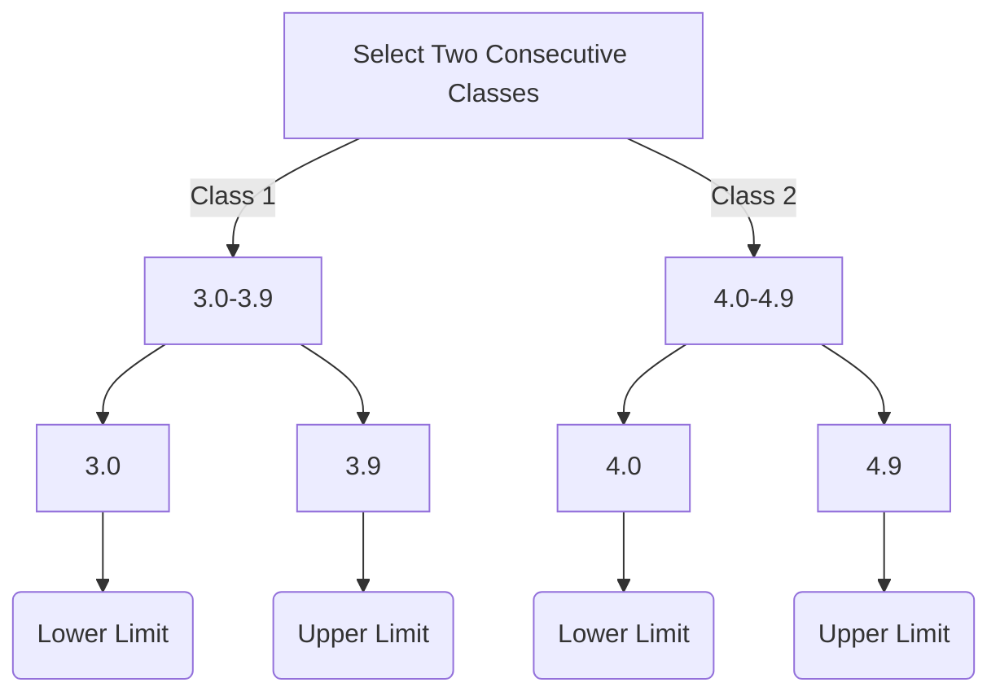

####  Now deduct Upper limit of class 1 from Lower limit of class 2
##### (4.0 - 3.9) = 0.1 
#### Now devide the answer i.e. 0.1 by 2 
##### 0.1/2 = 0.05
#### Deduct 0.05 from all the lower limits classes
#### Add 0.05 to all the upper limits of classes
