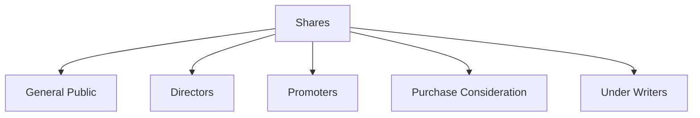
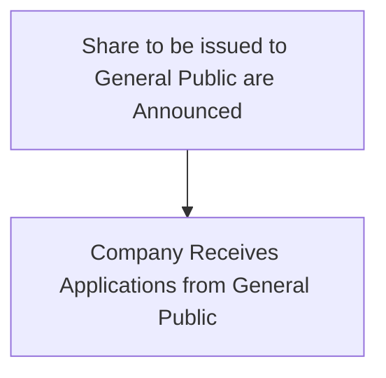

# Share and Share Capital

## Parties to whom shares are Issued 

```mermaid

graph TD

A[Shares]-->B[General Public]
A[Shares]-->C[Directors]
A[Shares]-->D[Promoters]
A[Shares]-->E[Purchase Consideration]
A[Shares]-->F[Under Writers]

```

## Procedure of Issue of Shares to General Public

```mermaid
graph TD

A[Share to be issued to General Public are Announced]-->B[Company Receives Applications from General Public]


```
