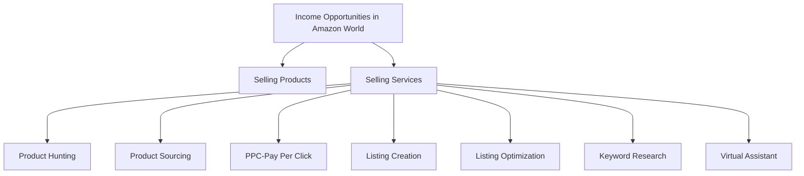
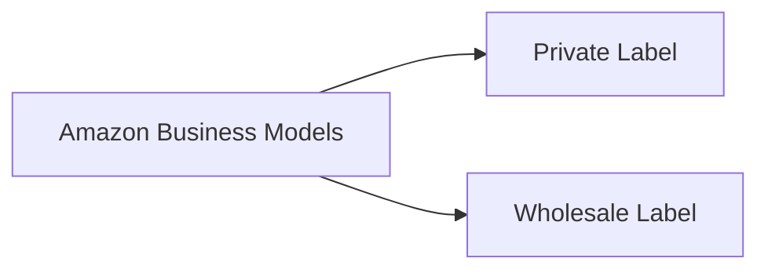

## Income Opportunities in Amazon World as an Investor

## What is Amazon

- It is an online Market Place
- It is basically a platform where many sellers are selling their products and different buyers purchase goods from these sellers
- It is just as Daraz i.e. operating in Pakistan
- Amazon Id can be created from 105 Contries in the World

## Amazon Business Models

