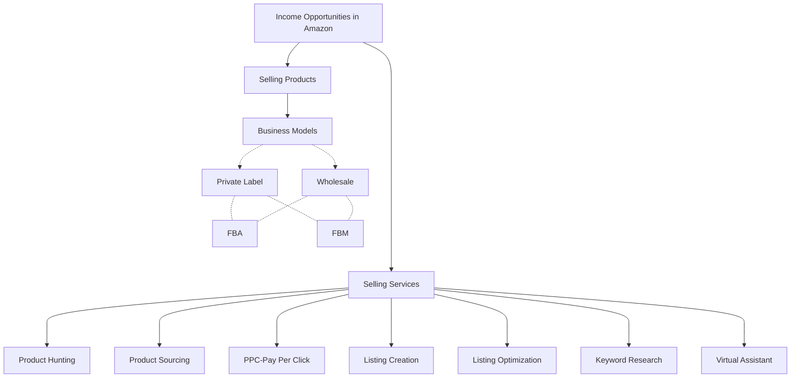
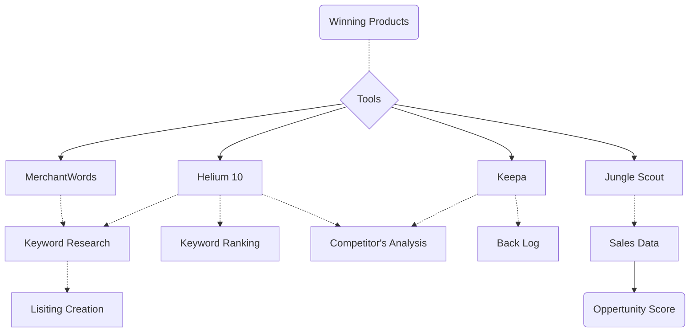
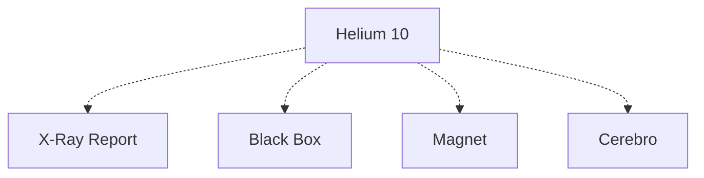
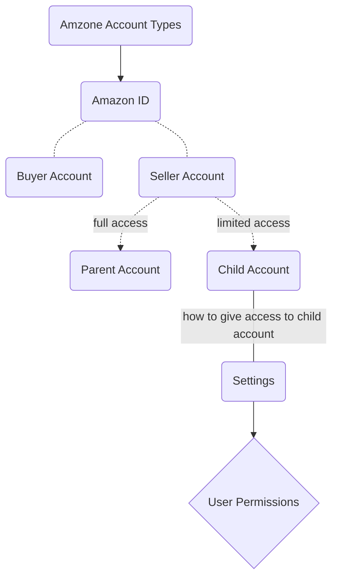

# Amazon and Virtual Assistant

---

### Income Opportunities in Amazon World as an Investor
 

---

### Advantages and Disadvantages of Private Label
#### Advantages
- Building Brand
- Once brand is build asset can be flipped
- Higher incomes in case product succeeded
#### Disadvantages
- Require higher costs
- Long Process
- Higher Risk Factor
- Risk of Insolvency

### Advantages and Disadvantages of Private Label

#### Advantages
- Low Risk Factor
- Require no high investment
#### Disadvantages
- Not higher profits
- No own brand building

---

### Tools for Product Hunting

#### Helium 10 Tools
- Mainly used for private label

#### Google Trends 
- Google Trends are used to know whether the products are seasonal or not
- First Select Market
- Any Product that is above 25 is not seasonal

#### Keepa 
- Mainly Used in Dropshipping and Wholesale platform

---
### Amazon Account Types

---

### Amazon Seller Account Requirements

- Amazon Seller Account can be created from 105 Countries
- Passport or ID Card
- Email Address
- Mobile Number
- Utility Bill
- Bank Statement(Just Required for Proof of Account and Address Etc)
- Debit/Credit Card (Master or Visa)

---
