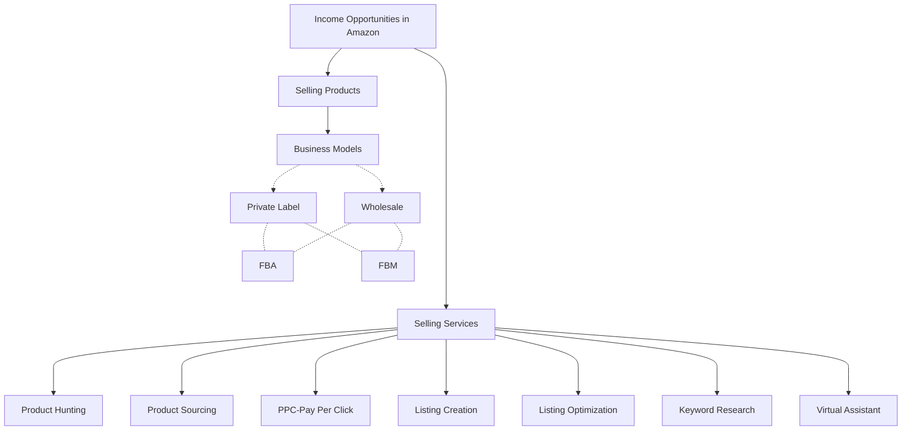
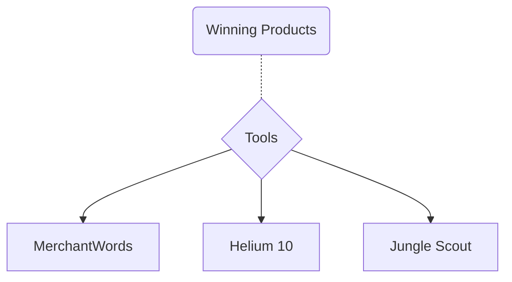
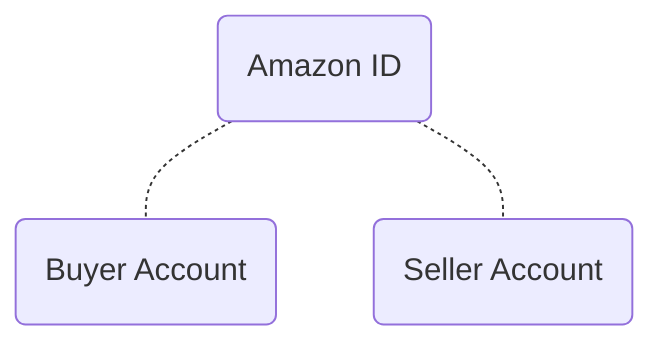

## Online Markets

These are the market places where different sellers sell their products. The buyers order these products virtually and these products are delivered as per their orders by these sellers via platfarm on which these sellers are registered.

Some examples of big online markets are:
- Amazon
- Ebay
- Etsy
- Wallmart
- Daraz
- Ali Express
- Ali Baba

## Income Opportunities in Amazon World as an Investor
 

## Advantages and Disadvantages of Private Label
#### Advantages
- Brand is building
- Asset Flip
- Higher incomes in case product succeeded
#### Disadvantages
- Require higher costs like marketing etc
- Long Process
- Higher Risk Factor
- Risk of Insolvency
#### Advantages
- Low Risk Factor
#### Disadvantages
- Not higher profits

## Type Amazon Accounts

### Amazon Seller Account Requirements

- Passport or ID Card
- Email Address
- Mobile Number
- Utility Bill
- Bank Statement(Just Required for Proof of Account and Address Etc)
- Debit/Credit Card (Master or Visa)
- 

