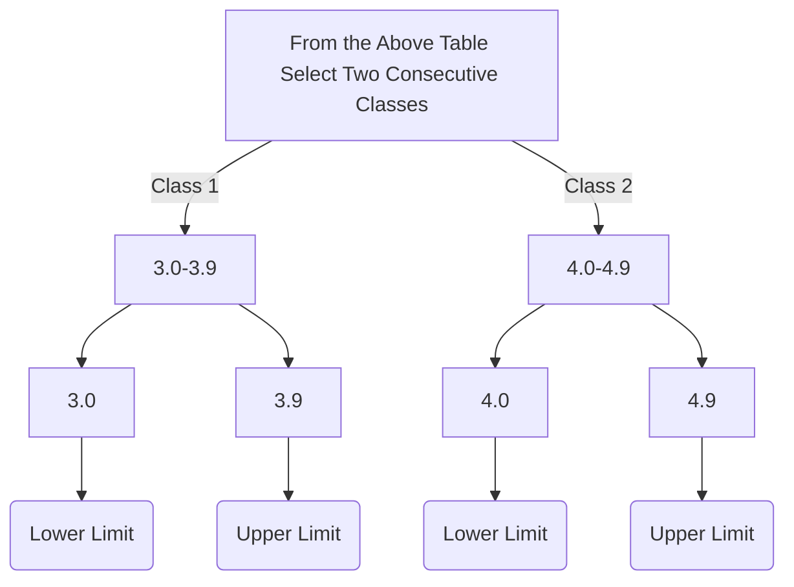

# How to Make Class Boundries from Classes

| Classes | Frequency |
| --- | :---: |
|3.0-3.9|  3 |
|4.0-4.9|  5 |
|5.0-5.9|  11 |
|6.0-6.9|  13 |
|7.0-7.9|  9 |
|8.0-8.9|  7 |
|9.0-9.9|  2 |

####  Now deduct Upper limit of class 1 from Lower limit of class 2
##### (4.0 - 3.9) = 0.1 
#### Now devide the answer i.e. 0.1 by 2 
##### 0.1/2 = 0.05
#### Deduct 0.05 from all the lower limits classes in above table
#### Add 0.05 to all the upper limits of classes in above table

| Classes | Frequency | Class Boundries | - 0.05 from L.L | + 0.05 in U.L |
| --- | :---: | --- | --- |  --- |
|3.0-3.9|  3 |2.95-3.95 | (3.0 - 0.05) = 2.95|(3.9 + 0.05) = 3.95|
|4.0-4.9|  5 |3.95-4.95 | (4.0 - 0.05) = 3.95|(4.9 + 0.05) = 4.95|
|5.0-5.9|  11 |4.95-5.95 |(5.0 - 0.05) = 4.95|(5.9 + 0.05) = 5.95|
|6.0-6.9|  13 |5.95-6.95 |(6.0 - 0.05) = 5.95|(6.9 + 0.05) = 6.95|
|7.0-7.9|  9 |6.95-7.95 |(7.0 - 0.05) = 6.95|(7.9 + 0.05) = 7.95|
|8.0-8.9|  7 |7.95-8.95 |(8.0 - 0.05) = 7.95|(8.9 + 0.05) = 8.95|
|9.0-9.9|  2 |8.95-9.95 |(9.0 - 0.05) = 8.95|(9.9 + 0.05) = 9.95|

