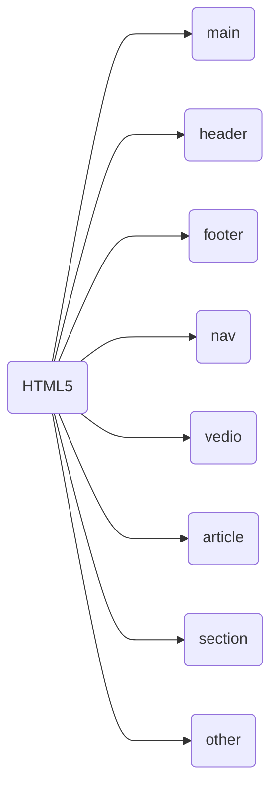

### HTML Element

- Besides opening and closing tags there is another tag which is self-closing tag
- For example ``````
- In the above example ```img``` element name while ```src``` is an attribute 

>Note: As a convention, all HTML tags are written in lowercase, for example ```<h1></h1>``` and not ```<H1></H1>```.

---
### Heading Elements

|Heading Type| Heading Element |
|---|---|
|Main Heading| ```h1```|
|Sub Headings|```h2```,```h3```,```h4```,```h5```,```h6```|
>*Note: Higher the Number lower the importance of Heading*
---
### Heading ELement Exmples
|Heading Element| Result |
|---|---|
|```<h1>Hello World</h1>```|<h1>Hello World</h1>|
|```<h2>Hello World</h2>```|<h2>Hello World</h2>|
|```<h3>Hello World</h3>```|<h3>Hello World</h3>|
|```<h4>Hello World</h4>```|<h4>Hello World</h4>|
|```<h5>Hello World</h5>```|<h5>Hello World</h5>|
|```<h6>Hello World</h6>```|<h6>Hello World</h6>|

---
### Paragraph Element 
```p``` element is used for paragraph text on websites, It looks like this:
```html
<p>This is paragraph</p>
```
---
### Comments in HTML
- Comments in HTML start with ```<!--``` and end with a ```-->```
- Commenting is a way to leave comments for other developers
- Commenting is the convinent way to make code inactive without having to delete it entirely
---
### HTML5 Elements 
- HTML5 introduced descriptive elements
- These give descriptive sturcture to HTML 
- These elements help Search Engine Optimiztion(SEO) and accessibility


---
