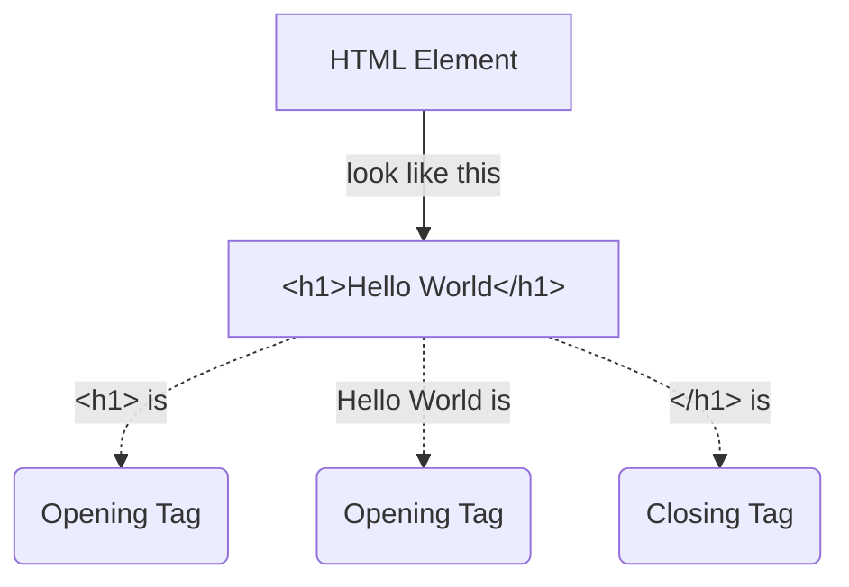

## HTML 
- Hyper Text Markup Language
- Created in **1993**


### HTML Element

> Note: As a convention, all HTML tags are written in lowercase, for example ```<h1></h1>``` and not ```<H1></H1>```.
