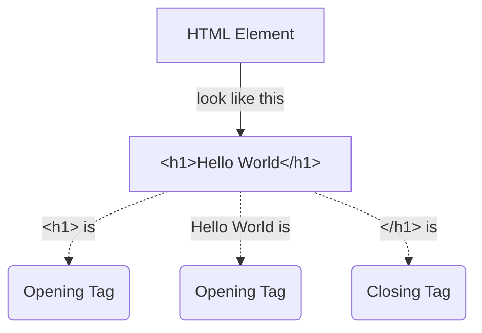
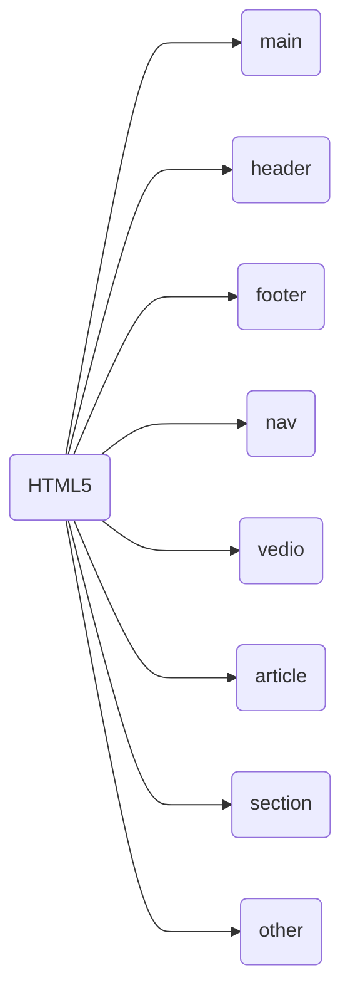
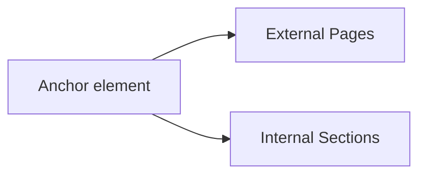
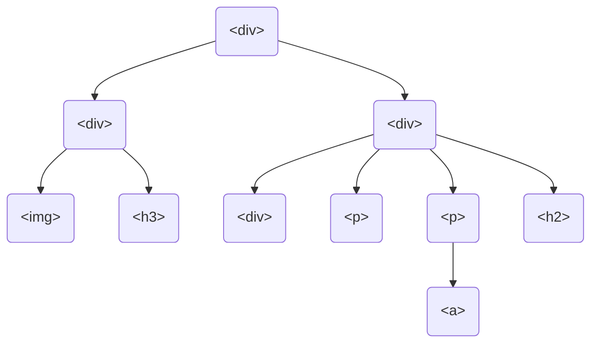
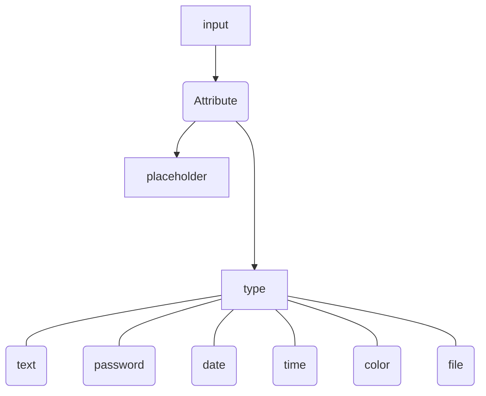

## HTML 
- Hyper Text Markup Language
- Created in **1993**


### HTML Element

> Note: As a convention, all HTML tags are written in lowercase, for example ```<h1></h1>``` and not ```<H1></H1>```.

---
### Heading Elements

|Heading Type| Heading Element |
|---|---|
|Main Heading| ```h1```|
|Sub Headings|```h2```,```h3```,```h4```,```h5```,```h6```|
>*Note: Higher the Number lower the importance of Heading*

#### Heading ELement Exmples
|Heading Element| Result |
|---|---|
|```<h1>Hello World</h1>```|<h1>Hello World</h1>|
|```<h2>Hello World</h2>```|<h2>Hello World</h2>|
|```<h3>Hello World</h3>```|<h3>Hello World</h3>|
|```<h4>Hello World</h4>```|<h4>Hello World</h4>|
|```<h5>Hello World</h5>```|<h5>Hello World</h5>|
|```<h6>Hello World</h6>```|<h6>Hello World</h6>|

---
### Paragraph Element 
```p``` element is used for paragraph text on websites, It looks like this:
```html
<p>This is paragraph</p>
```
##### Output
<p>This is paragraph</p>

---

### Comments in HTML
- Comments in HTML start with ```<!--``` and end with a ```-->```
- Commenting is a way to leave comments for other developers
- Commenting is the convinent way to make code inactive without having to delete it entirely

```html
<h1>This is main Heading</h1>
<h2>This is Sub Heading</h2>
<p>This is paragraph</p>
<!-- This is comment
<h2>This is Second Sub Heading</h2>
-->
<p>This is second paragraph</p>
```
##### Output
<h1>This is main Heading</h1>
<h2>This is Sub Heading</h2>
<p>This is paragraph</p>
<!-- This is comment
<h2>This is Second Sub Heading</h2>
-->
<p>This is second paragraph</p>

---
### HTML5 Elements 
- HTML5 introduced descriptive elements
- These give descriptive sturcture to HTML 
- These elements help Search Engine Optimiztion(SEO) and accessibility


---
### Adding Images to website 

| Element | Attributes |
| --- | --- |
|```img```|  ```src``` , ```alt```, ```loding```|         


- Images can be added using ```img``` element
- ```src``` attribute is used to point a specific image's URL or image's path
- ```alt``` attribute must be included in ```img``` elements
  - The text inside an ```alt``` attribute is used for screen readers to improve accessibility and is displayed if the image fails to load
  - If the image is purely decorative, using an empty ```alt``` is best practice 
  - Ideally the ```alt``` attribute should not contain special characters unless needed
- Hack to behave image responsive use ```width``` attribute with value ```100%```
- Images can be borrowed online or some online storage
- Base64 can also be used to render the images source
```html

```
##### output


---


### Self-closing Tag
- A tag without closing tag is known as self-closing tag

|Self-Closing Tags| Purpose |
|---|---|
|``````| Adding Images |
|```<hr/>```||
|```<br/>```||
|```<link/>```||
|```<input/>```||


---
### Linking to external pages and internal sections in a webpage



| Element | Attributes |
| --- | --- |
|```a```|  ```href``` , ```target="_blank"```,|


- ```a``` *(anchor)* element is used to link external pages and internal sections in a webpage
- ```href``` attribute is used to put the address of the linking page or section 
- ```target``` attribute with value ```_blank``` is used to open the page in new tab
- Anchor text is added in opening and closing tags of an *(anchor)* element 
- The browser displays that text as a link that is clickable
- ```#``` is used with id value to link internal sections in a webpage
- *(anchor)* element can be used within text
```html
<p>This is a paragraph in which <a target="_blank" href="https://github.com/khurramshahzadlali">anchor element</a> is nested</p> 
```
##### Output
<p>This is a paragraph in which <a target="_blank" href="https://github.com/khurramshahzadlali">anchor element</a> is nested</p> 

---

### Scrimba Challenge Example

```html
<h1>Humans have reached Mars</h1>

<h3>The Starship rocket successfully landed on the red planet this morning.</h3>
<p>After a 115 days long journey, the crew of 12 finally arrived at their destination. This is the first time humans have set foot on a planet other than Earth.</p>

```
##### Output
<h1>Humans have reached Mars</h1>

<h3>The Starship rocket successfully landed on the red planet this morning.</h3>
<p>After a 115 days long journey, the crew of 12 finally arrived at their destination. This is the first time humans have set foot on a planet other than Earth.</p>


---
### Nesting

```html
<div>
  <h1>Humans have reached Mars</h1>
  
  <h3>The Starship rocket successfully landed on the red planet this morning.</h3>
  <p>After a 115 days long journey, the crew of 12 finally arrived at their destination. This is the first time humans have set foot on a planet other than Earth.</p>
  
</div>  
  
```
#### HTML document tree

---

### Intractive Elements 

- ```button```
- ```Input```



### Scrimba Challenge Example

```html
<h1>Welcome</h1>
<p>You have been granted access to the platform. 
Please create an account.</p>
<input type="text" placeholder="Enter username">
<input type="password" placeholder="Enter password">
<input type="file">
<button>Sign Up!</button>

```


